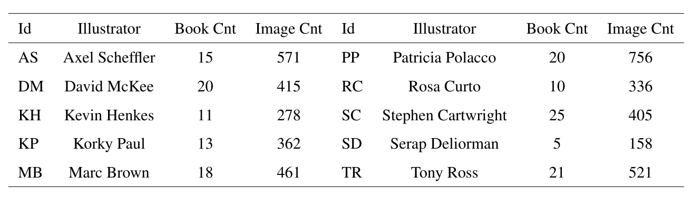
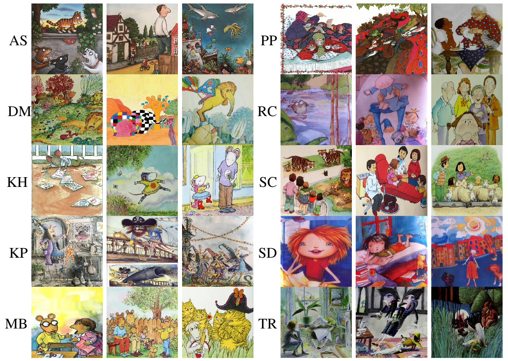
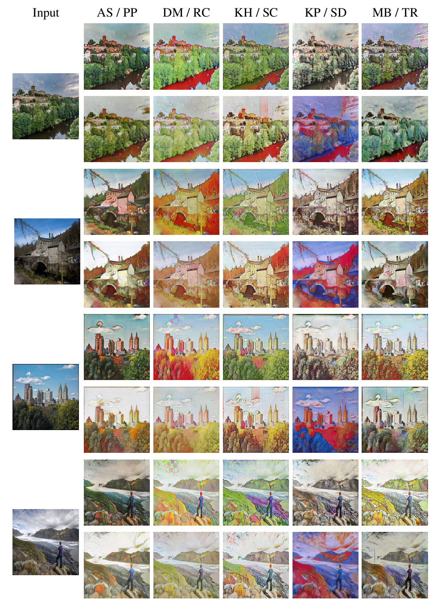
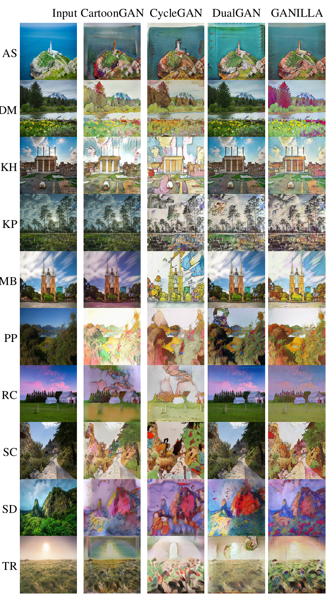
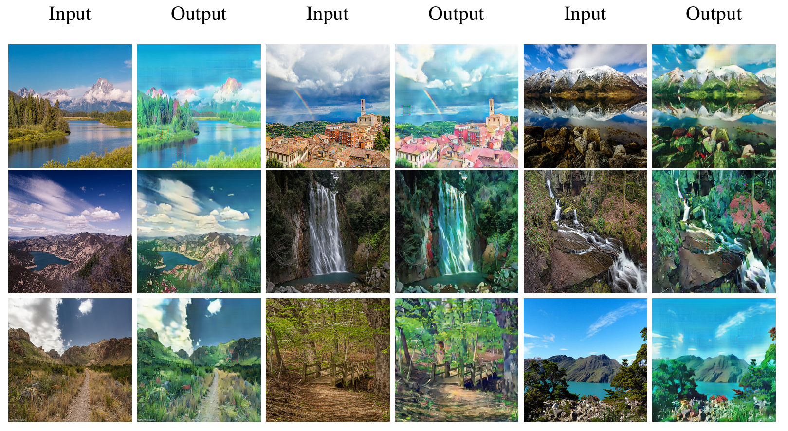
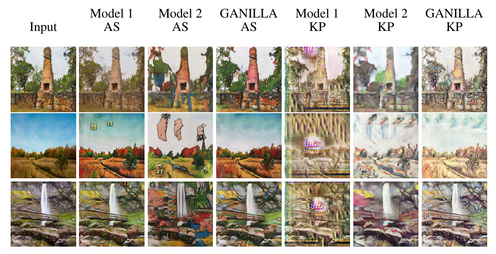

# GANILLA 

GANILLA: Generative Adversarial Networks for Image to Illustration Translation.

[Paper](https://www.sciencedirect.com/science/article/pii/S0262885620300184)
[Arxiv](https://arxiv.org/abs/2002.05638)


**Dataset Stats:**



**Sample Images:**




**GANILLA**:


**GANILLA results on the illustration dataset:**



**Comparison with other methods:**



**Style transfer using Miyazaki's anime images:**



**Ablation Experiments:**



## Prerequisites
- Linux, macOS or Windows
- Python 2 or 3
- CPU or NVIDIA GPU + CUDA CuDNN


## [Training/Test Tips](docs/tips.md)
Best practice for training and testing your models.


## Citation

```
@article{hicsonmez2020ganilla,
  title={GANILLA: Generative adversarial networks for image to illustration translation},
  author={Hicsonmez, Samet and Samet, Nermin and Akbas, Emre and Duygulu, Pinar},
  journal={Image and Vision Computing},
  pages={103886},
  year={2020},
  publisher={Elsevier}
}

@inproceedings{Hicsonmez:2017:DDN:3078971.3078982,
 author = {Hicsonmez, Samet and Samet, Nermin and Sener, Fadime and Duygulu, Pinar},
 title = {DRAW: Deep Networks for Recognizing Styles of Artists Who Illustrate Children's Books},
 booktitle = {Proceedings of the 2017 ACM on International Conference on Multimedia Retrieval},
 year = {2017}
}
```
## Acknowledgments
The code is heavily inspired by [CycleGAN](https://github.com/junyanz/pytorch-CycleGAN-and-pix2pix).

The numerical calculations reported in this work were fully performed at TUBITAK ULAKBIM, High Performance and Grid Computing Center (TRUBA resources).